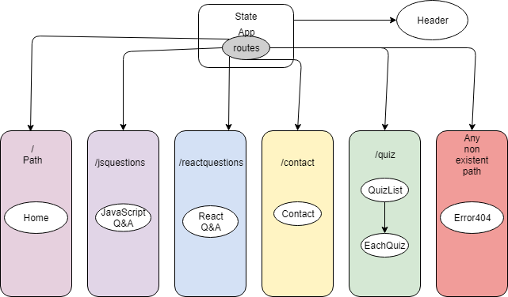

# _Capstone Project_

## _Epicodus React Week 4 project. 03.8.2019_

### By _**Manasa Vesala**_

### Name: LearnAndQuiz

## Description

_A web application that allows users to prepare and practice for technical interviews by providing content to study and take quiz on intrested language._

## Minimum Features

* _It consists of home page, where user have different programming languages to select._
* _if a user clicks or selects a programming language then he can see list of may question and answers where he can prepare for interview._
* _In home page there is a link for Quiz, where it takes to another page with list of topics for quiz._
* _If user clicks on the topic he can take the quiz._ 
* _In the AddQuestions page user can add question to the existing list of questions for the desired language can dynamically make changes to site._
* _After the quiz is done it shows the score of the user._
* _Contact page, where people can contact me to discuss about the webpage._

## Minimum Technologies

* _JavaScript_
* _React_
* _Node.js_
* _HTML_
* _UIKit_
* _Firebase_

## Outline Diagram

## Wishlist Features

* _Add levels to quiz by increasing the complexity._
* _Add user authontication where user can login, and see all his previous score._
* _Navigate to the project folder in the terminal._
* _Authorized user can Add questions to dynamically make changes to site._

## Support and contact details

* _ Manasa Vesala - vesalamanasa@gmail.com_